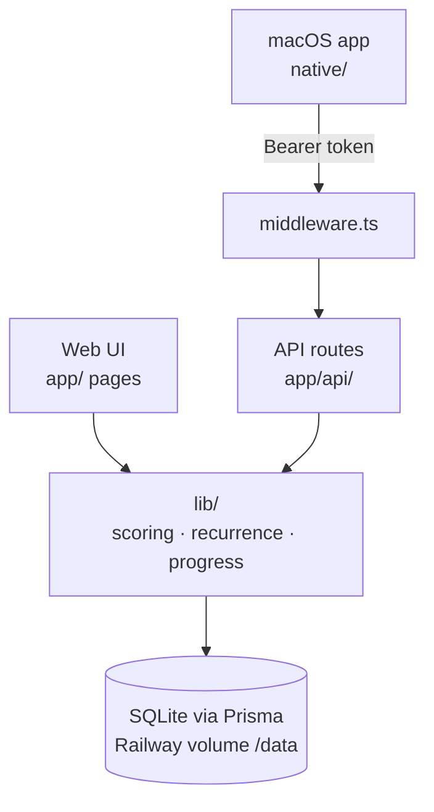

# STATE — <!-- updated: 2026-09-29 -->

## Current focus
Railway 24/7 deploy is prepared and rehearsed end-to-end locally (prod build with no DB,
`migrate deploy` onto an empty volume, token auth, lossless data restore). Next: merge the PR,
create the Railway project (user's account/billing), then point the Mac app at it.

## Shape

## Done (condensed)
- **Web core (Sprints 1–3)** — recurrence engine, progress/history, streaks, day detail, working week,
  undo, performance sections, a11y, prod hardening + hermetic CI (98 unit / 33 E2E tests)
- **Native macOS app** — XcodeGen project (`native/macOS/project.yml`, generated `Info.plist` now
  tracked); Swift models match API JSON (contract tests); ‹ day › nav to check/uncheck any past day;
  outages show "Can't reach server" instead of a fake empty list; undo sends a JSON body (was a 500) —
  42 ScoreDayCore tests
- **Fixed the weekly dev-server crash** — GBs of Xcode/SwiftPM build output under `native/` were scanned
  by the web toolchain (tsconfig excluded only node_modules): dev crashed with `RangeError: Invalid array
  length` compiling `/_not-found`, `next build` ran out of memory. Fenced off via tsconfig `exclude` +
  Tailwind `@source not "../native"`; Xcode builds now go to the default DerivedData outside the repo
- **Railway-ready** — `railway.json` (1 replica, restart on failure); `start:prod` =
  `prisma migrate deploy && next start -p $PORT`; `build` runs `prisma generate`; `prisma` is a runtime
  dependency; Node >=22; `middleware.ts` secret guard on pages + `/api/*` when `API_TOKEN` is set (open for
  local dev); `GET /api/dashboard[?date=]`; soft-delete `DELETE /api/tasks/[id]`
- **Lossless migration, both ways** — `npm run db:export` (local DB or a server via `GET /api/admin/export`)
  → `npm run db:import` → one-shot `POST /api/admin/restore`
  (token-only, refuses a non-empty DB); rehearsed: 13 tasks / 12 completions identical
- **Pages protected (Sep 29)** — live probe showed `/` and `/progress` served DB data without auth (matcher
  covered only `/api`); browsers now get a Basic-auth prompt (password = token); matcher regression test
- **Mac app auth** — token in Keychain; Settings has token field + working Test Connection; a 401 says
  "token rejected", not "can't reach server"
- **Recovered from folder loss (Sep 28)** — project folder was moved to Trash and lost; re-cloned from
  GitHub and redone; `dev.db` rescued intact from the still-running server's open file handle
  (backup in `~/ScoreDay-rescue/`). The user's own uncommitted web edits from before Sep 18 were lost

## In progress
- **Railway setup (user action)** — new project from the GitHub repo, volume at `/data`, env
  `DATABASE_URL=file:/data/prod.db` + `API_TOKEN`; then `db:export`/`db:import`; then URL + token in the app
- Native iOS app: sources only, needs an XcodeGen `project.yml` like macOS

## Next up
- macOS UX gaps: prefill edit form, apply server URL/token without relaunch
- GRDB local cache (compiled, unused): wire for offline use or drop it — less urgent once hosted
- Visual/product redesign phase
- TIMES_PER_WEEK flexible quota (e.g., "gym 4× any days")

## Blocked / needs research
- Native app: background sync strategy, conflict resolution

## Known issues
- Local dev: run `npm run dev` (localhost only) and keep the project out of folders that get cleaned
- SQLite on a volume = single instance only; turn on Railway volume backups
- Ad-hoc–signed Mac app: macOS may ask to allow Keychain access after a rebuild ("Always Allow")
- `PUT /api/tasks/[id]` is full-replace: omitted fields (e.g. category) are cleared; clients send all fields
- macOS: editing a task opens the form with empty fields
- Web app has no UI for back-filling past days (the Mac app does)
